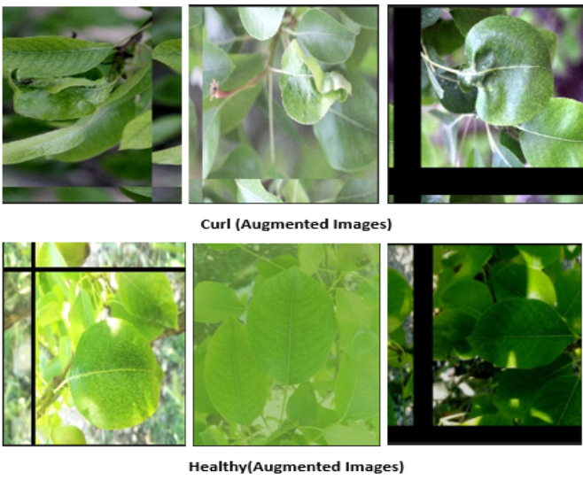
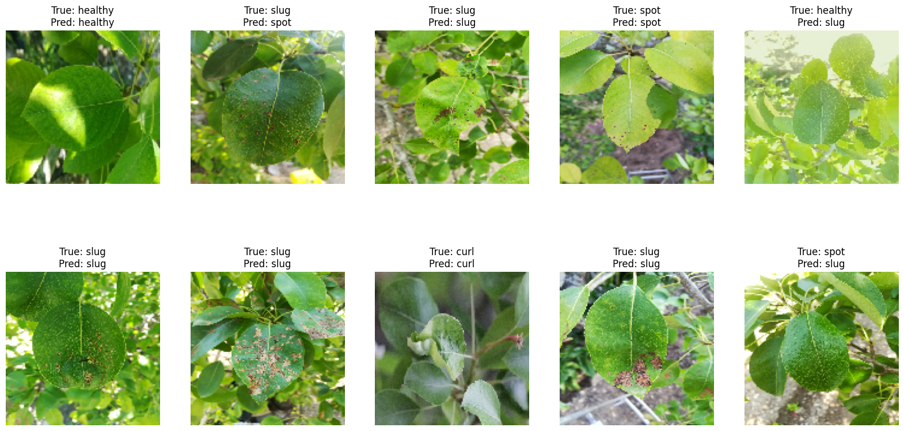

# 🍐 Pear Leaf Disease Detection & Classification

This project presents a **hybrid deep learning pipeline** to detect and classify visually similar pear leaf diseases. It integrates **Siamese Convolutional Neural Networks (SCNN)**, **Variational Autoencoders (VAE)**, and a **Support Vector Machine (SVM)** for robust performance under low-data conditions. The system leverages contrastive learning and latent feature embeddings to enhance interpretability and generalization.

---

## 🌟 Key Features

- **Siamese CNN (SCNN)** for learning pairwise visual similarity  
- **Variational Autoencoder (VAE)** to learn meaningful latent distributions  
- **Enhanced Embedding (`enhanced_z`)** by combining SCNN features and VAE latent codes  
- **SVM Classifier** trained on enhanced features for final prediction  
- **Data Augmentation** including flips, rotations, and noise to avoid overfitting  
- **Visualization Tools**: PCA projection, confusion matrix, and prediction heatmaps  

---

## 🚀 Run on Google Colab

> 📌 Ensure your dataset is uploaded to `/MyDrive/pear`

### ✅ Steps:

1. Open the `.ipynb` notebook in Google Colab  
2. Mount Google Drive:
   ```python
   from google.colab import drive
   drive.mount('/content/drive')
   ```
3. Set dataset path:
   ```python
   DATASET_PATH = '/content/drive/MyDrive/pear'
   ```
4. Run all cells to:

   - Load and preprocess images  
   - Train SCNN-VAE model  
   - Generate features and train SVM  
   - Evaluate and visualize results  

---

## 🏗️ Model Architecture

| Component              | Description                                              |
| ---------------------- | -------------------------------------------------------- |
| **Siamese CNN**        | Learns visual encoding from image pairs                  |
| **VAE**                | Captures generative latent space via encoder-decoder     |
| **Enhanced Embedding** | Concatenation of SCNN output and VAE latent vector (`z`) |
| **SVM**                | Classifier trained on enhanced features                  |

---

## 📊 Results

- **Final Accuracy**: **76.31%**

### Classification Report:

| Class       | Precision | Recall   | F1-score |
| ----------- | --------- | -------- | -------- |
| Curl        | 0.88      | 0.93     | 0.91     |
| Healthy     | 0.74      | 0.73     | 0.73     |
| Spot        | 0.59      | 0.40     | 0.48     |
| Slug        | 0.78      | 0.88     | 0.83     |
| **Overall** | **0.76**  | **0.76** | **0.76** |

---

## 🖼️ Visualizations

### 🔷 PCA Projection (SCNN Features)


> 2D PCA projection of SCNN features showing clustering of disease classes. "Slug" class appears well-separated; slight overlap between "Healthy" and "Spot".

---

### 📊 Confusion Matrix


> Majority of errors occur between **Spot** and **Slug**, likely due to their visual similarity. "Curl" is most confidently predicted.

---

### 🌱 Data Augmentation Samples



> Various augmentations like flipping, rotation, and noise help increase robustness under limited data scenarios.

---

### 🔍 Sample Predictions (True vs Predicted)



> The model performs well on challenging cases, though some confusion remains between **Spot** and **Slug**.

---

## 🧠 Conclusion

This hybrid approach shows promise for real-world agricultural diagnostics, especially where labeled data is scarce. Future work can explore domain adaptation and self-supervised learning to improve generalizability across different crop types.

---
